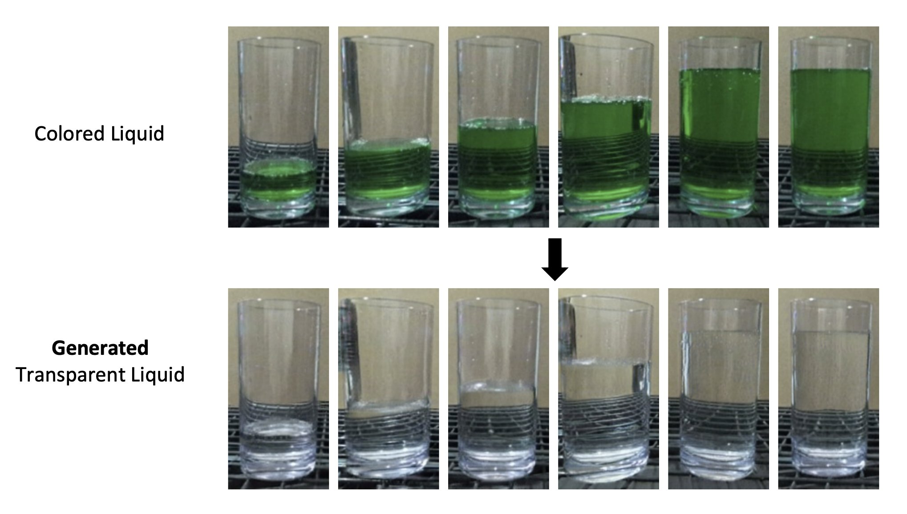
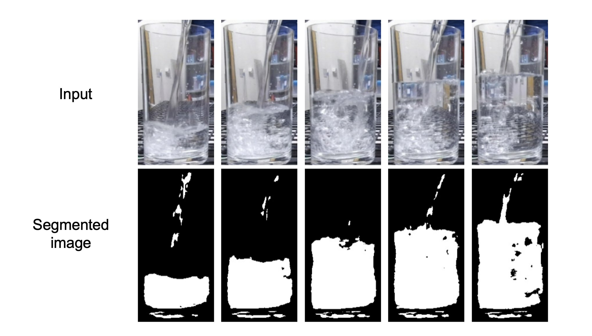
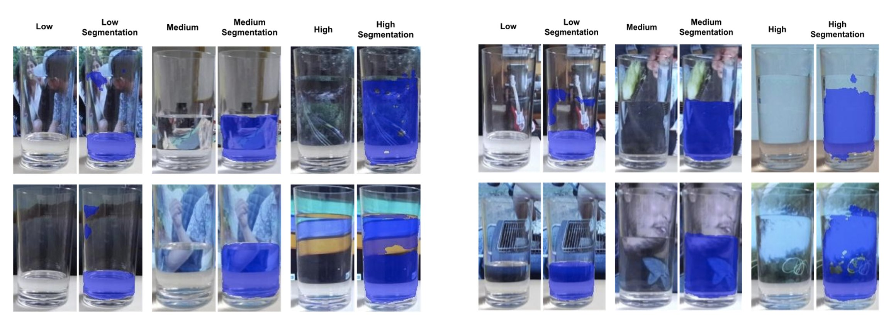
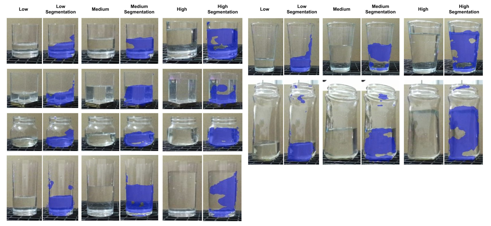

# Self-supervised Transparent Liquid Segmentation for Robotic Pouring

## [Video](https://youtu.be/uXGCSd3KVd8) | [Website](https://sites.google.com/view/transparentliquidpouring) | [Paper](https://www.google.com/url?q=https%3A%2F%2Farxiv.org%2Fabs%2F2203.01538&sa=D&sntz=1&usg=AOvVaw3d5pQfrbcL9HH5mwauGDwD)

<!-- In this paper we use image translation to segment transparent liquids such as water for robotic pouring.  -->


**ABSTRACT:** Liquid state estimation is important for robotics tasks such as pouring; however, estimating the state of transparent liquids is a challenging problem. We propose a novel segmentation pipeline that can segment transparent liquids such as water from a static, RGB image without requiring any manual annotations or heating of the liquid for training. Instead, we use a generative model that is capable of translating unpaired images of colored liquids into synthetically generated transparent liquid images. Segmentation labels of colored liquids are obtained automatically using background subtraction. We use paired samples of synthetically generated transparent liquid images and background subtraction for our segmentation pipeline. Our experiments show that we are able to accurately predict a segmentation mask for transparent liquids without requiring any manual annotations. We demonstrate the utility of transparent liquid segmentation in a robotic pouring task that controls pouring by perceiving liquid height in a transparent cup.

**Gautham Narayan Narasimhan**, Kai Zhang, Ben Eisner, Xingyu Lin, David Held

International Conference of Robotics and Automation (ICRA), 2022

<!-- For colored liquids, we obtain a segmentation mask using background subtraction. And, to segment transparent liquids we use image translation to convert colored liquids to transparent liquids, which gives us paired transparent liquid images with segmentation labels. -->

<!--  -->
## Image Translation (colored -> transparent liquid)
<p align="center">

</p>

<!-- We are able to segment clear water whether it is static, in motion and even if it has bubbles. -->
## Image Segmentation (Self-supervision from background subtraction)
<p align="center">

</p>


## Generalization to novel backgrounds
<p align="center">

</p>

## Generalization to novel container shapes
<p align="center">

</p>

# Getting Started

- Clone this repo and install requirements

```
git clone https://github.com/gauthamnarayan/transparent-liquid-segmentation
virtualenv pouring_env --python=python3.6 --no-site-packages
source pouring_env/bin/activate
pip install -r requirements.txt
cd Segment_Transparent_Objects
pip install -e .
```

- Download pre-trained weights (16.pth) for [Segment_Transparent_Objects](https://github.com/xieenze/Segment_Transparent_Objects) from [here](https://drive.google.com/drive/folders/1yJMEB4rNKIZt5IWL13Nn-YwckrvAPNuz)

```
mkdir -p Segment_Transparent_Objects/demo
cp 16.pth Segment_Transparent_Objects/demo
```

Additional instructions can be found at [contrastive-unpaired-translation (CUT)](https://github.com/taesungp/contrastive-unpaired-translation) and [Segment_Transparent_Objects](https://github.com/xieenze/Segment_Transparent_Objects)

## Dataset Generation

Please use the datasets and pre-trained models provided below to quickly get started and please maintain the same dataset structure provided.

[pouring_datasets_ICRA_2022](https://drive.google.com/file/d/1BYWVQTOjQqaYpAfLxQY6pxYWs3vKvXev/view?usp=sharing)

```
mkdir -p data/datasets
mkdir -p data/saved_models
cp -r pouring_training_videos pouring_testset_videos data/datasets
```

We do not expect our pre-trained models to generalize beyond our lab due to the complex lighting conditions involved; Our training procedure is easy to use and self-supervised so it would be best to retrain the image translation and segmentation models with data collected on site.

## Cup segmentation
Run once for each video of opaque and colored liquids

```
cd Segment_Transparent_Objects/

python -u ./tools/test_demo.py --config-file configs/trans10K/translab.yaml TEST.TEST_MODEL_PATH ./demo/16.pth  DEMO_DIR ../data/datasets/pouring_training_videos/opaque/video_<id>

python -u ./tools/test_demo.py --config-file configs/trans10K/translab.yaml TEST.TEST_MODEL_PATH ./demo/16.pth  DEMO_DIR ../data/datasets/pouring_training_videos/transparent/video_<id>
```

## Prepare dataset

Prepares a dataset for the pipeline and also runs background subtraction for colored liquids.

```
cd ../scripts

python prepare_dataset.py \
--pouring-videos_dir ../data/datasets/pouring_training_videos/opaque/ \
--output-dir ../data/datasets/pouring_dataset/ \
--mode opaque

python prepare_dataset.py \
--pouring-videos_dir ../data/datasets/pouring_training_videos/transparent/ \
--output-dir ../data/datasets/pouring_dataset/ \
--mode transparent
```

# Image Translation


To train the image translation model, please use the following command.

```
cd ../contrastive-unpaired-translation/

python train.py --dataroot ../data/datasets/pouring_dataset/ \
                --name pouring_CUT \
                --CUT_mode CUT \
                --preprocess none
```
        
Run inference using a CUT model to obtain paired transparent liquid data.
``` 
python test.py --dataroot ../data/datasets/pouring_dataset \
               --name pouring_CUT \
               --CUT_mode CUT \
               --phase train \
               --preprocess none
```

###Pouring video dataset directory structure:

```trainA```: Opaque (green) liquid

```trainB```: Transparent (clear) liquid

```trainA``` -> image translation -> ```fakeB```


```
pouring_dataset
├── fakeB
├── trainA
├── trainA_cup_masks
├── trainA_liquid_masks
├── trainB
└── trainB_cup_masks
```

# Image Segmentation

To train the segmentation model (UNet), please use the following command.
```
cd ../scripts

python train_unet_transparent_pouring.py --train-data-dir ../data/datasets/pouring_dataset --save-dir ../data/saved_models
```

To test the segmentation model (UNet), please use the following command. Results from segmentation will be written out at ```--results-dir```.
```
python test_unet_transparent_pouring.py --model-path ../data/saved_models/<model_name> --test-videos-path ../data/datasets/pouring_testset_videos --results-dir ../results
```


# Notes:

- We use [labelme](https://github.com/wkentaro/labelme) to generate manual ground truth for evaluating the performance of our image segmentation method. 

- Translab might not produce good cup segmentation masks. In this case, please obtain the cup mask when the cup is empty (first few frames of pouring) and copy it to all subsequent frames where the cup position has not changed.

# Bibtex

```

@inproceedings{icra2022pouring,
title={Self-supervised Transparent Liquid Segmentation for Robotic Pouring},
author={Gautham Narayan Narasimhan, Kai Zhang, Ben Eisner, Xingyu Lin, David Held},
booktitle={International Conference on Robotics and Automation (ICRA)},
year={2022}}

```

# Acknowledgement

This material is based upon work supported by LG Electronics and National Science Foundation under Grant No. IIS-2046491.
